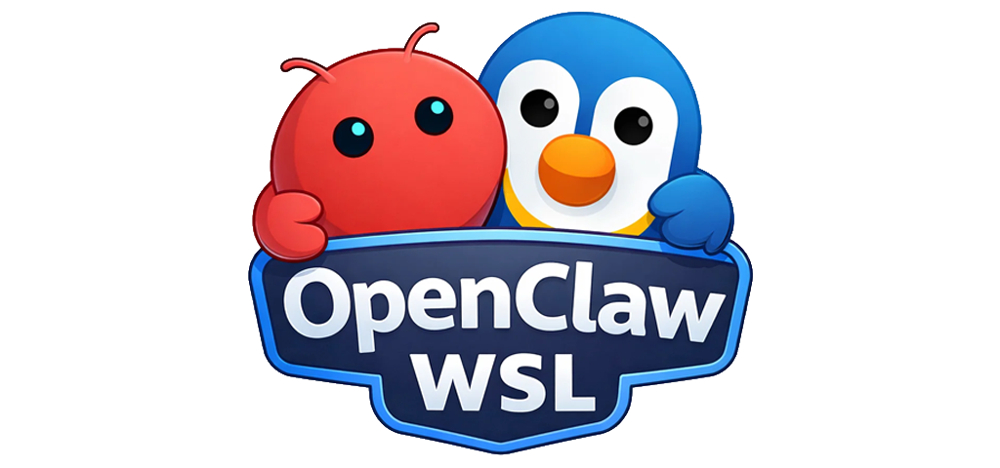

<p align="center">
  
</p>

# OpenClaw WSL Automation System

<p align="center">
  
  
  
  
  
</p>

> **⚠️ WARNING: Use at your own risk. This script modifies system configurations (WSL, network, filesystem). You are solely responsible for any issues that may arise.**

Portable PowerShell automation for installing and managing [OpenClaw](https://github.com/pjasicek/OpenClaw) in WSL. I created this to streamline my own workflow of testing multiple bots in isolated environments. Sharing in case others find it useful.

## Features

- Automated WSL setup with OpenClaw
- Fully portable (copy folder to any PC)
- **AI Profile Management** - Switch between multiple API keys and models
- Configurable filesystem isolation (full/limited/isolated)
- Optional network isolation (full/local-only/offline)
- Auto-import existing WSL data when moved

## Requirements

- Windows 10/11 with WSL support
- PowerShell 5.1+
- Administrator privileges

## Quick Start

**Double-click:** Run `Start.bat` → Follow menu → Use `OpenClaw.bat` to launch

**PowerShell:**
```powershell
git clone https://github.com/niittymaa/OpenClaw-WSL.git
cd OpenClaw-WSL
.\Start.ps1
```

## Directory Structure

```
OpenClaw-WSL/
├── Start.bat / Start.ps1     # Entry points
├── modules/                  # PowerShell modules
├── scripts/internal/         # Install/Uninstall scripts
├── config/defaults.json      # Configuration
└── .local/                   # GITIGNORED - local data
    ├── wsl/ext4.vhdx         # WSL virtual disk
    ├── data/                 # Shared folder
    ├── scripts/              # Generated launchers
    └── state.json            # Installation state
```

## Portability

Copy entire folder to new PC → Run `Start.ps1` → Select "Import Existing WSL [Portable]" → Done

## Installation Options

**Filesystem:** Full Windows access | Limited (shared folder only) | Fully isolated

**Network:** Full access | Local-only | Fully offline

## AI Profile Management

Manage multiple API keys for the same provider and switch between different AI models:

1. **View Profiles:** `Start.ps1` → Settings → AI Profile Management
2. **Switch Profile:** Select a profile → Choose model → Confirm
3. **Add Profiles:** Edit `~/.openclaw/agents/main/agent/auth-profiles.json` in WSL

### Multi-Key Setup for Same Provider

You can use multiple API keys for providers like Google Gemini or OpenAI:

**Example:** Two Google Gemini keys (one for testing, one for production)
```bash
# In WSL
cd ~/.openclaw/agents/main/agent
# Edit auth-profiles.json to add:
{
  "profiles": {
    "google:main": { "type": "api_key", "provider": "google", "key": "AIza..." },
    "google:backup": { "type": "api_key", "provider": "google", "key": "AIza..." }
  }
}
```

Then use the menu to switch between `google:main` and `google:backup` profiles.

## Updating

- **OpenClaw:** Run `Start.ps1` → "Install OpenClaw" → "Update OpenClaw only"
- **Scripts:** `git pull origin main`

## Uninstalling

Run `Start.ps1` → "Uninstall OpenClaw" → Type `UNINSTALL` to confirm

## Generated Scripts

After install, `.local/scripts/` contains: `launch-openclaw.ps1`, `open-shell.ps1`, `update-openclaw.ps1`, `stop-wsl.ps1`

## Troubleshooting

| Issue | Solution |
|-------|----------|
| WSL not available | Run `wsl --install` |
| Permission denied | Run as Administrator |
| Import fails | Ensure `.local/wsl/ext4.vhdx` was copied |

## Disclaimer

**This is a personal hobby project.** I created it to help my own process of playing around with multiple bots in isolated environments. Sharing in case someone else finds it useful.

**USE AT YOUR OWN RISK.** You are solely responsible for:
- Compliance with applicable laws in your jurisdiction
- Ensuring legal right to use any game assets with OpenClaw
- Any damage, data loss, or system changes that may occur
- Understanding that this modifies WSL, network settings, and filesystem permissions

This is an unofficial tool, not affiliated with or endorsed by the OpenClaw project. No support, maintenance, or updates guaranteed.

## License

MIT License

Copyright (c) 2026

Permission is hereby granted, free of charge, to any person obtaining a copy of this software and associated documentation files (the "Software"), to deal in the Software without restriction, including without limitation the rights to use, copy, modify, merge, publish, distribute, sublicense, and/or sell copies of the Software, and to permit persons to whom the Software is furnished to do so, subject to the following conditions:

The above copyright notice and this permission notice shall be included in all copies or substantial portions of the Software.

THE SOFTWARE IS PROVIDED "AS IS", WITHOUT WARRANTY OF ANY KIND, EXPRESS OR IMPLIED, INCLUDING BUT NOT LIMITED TO THE WARRANTIES OF MERCHANTABILITY, FITNESS FOR A PARTICULAR PURPOSE AND NONINFRINGEMENT. IN NO EVENT SHALL THE AUTHORS OR COPYRIGHT HOLDERS BE LIABLE FOR ANY CLAIM, DAMAGES OR OTHER LIABILITY, WHETHER IN AN ACTION OF CONTRACT, TORT OR OTHERWISE, ARISING FROM, OUT OF OR IN CONNECTION WITH THE SOFTWARE OR THE USE OR OTHER DEALINGS IN THE SOFTWARE.
